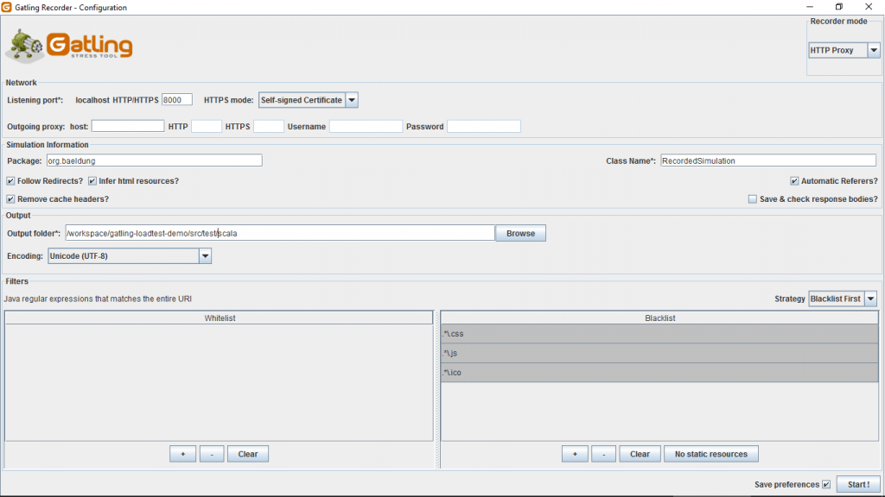
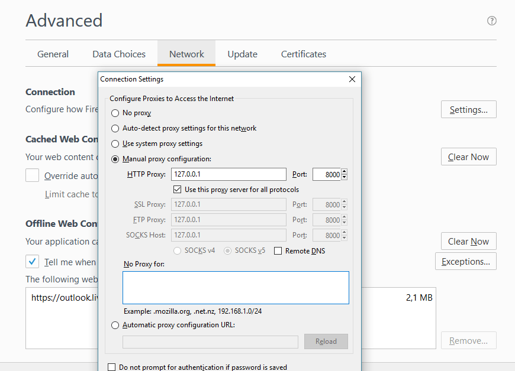

## Create the Tests in the Scala/Gatling Application

##Executing the Tests for Scala/Gatling


```bash
mvn clean verify -P scala-integration-tests
```
This command will 

1. start up a working API, via docker containers, to be used in the tests
2. Execute the tests
3. stop the working API


NOTES:


### Gatling Recorder Proxy mode

#### Run Gatling Prxoy mode recorder   
mvn gatling:recorder -P scala-integration-tests

Configuring the Recorder
First of all launch the Recorder class from the IDE.   
mvn gatling:recorder -P scala-integration-tests

Once launched, the GUI lets you configure how requests and responses will be recorded. Choose the following options:

8000 as listening port
org.baeldung.simulation package
RecordedSimulation class name
Follow Redirects? checked
Automatic Referers? checked
Black list first filter strategy selected
.*\.css, .*\.js and .*\.ico in the black list filters




#### Configure Browser to use Gatl;ing proxy to record Simulation
Now we have to configure our browser to use the defined port (8000) chosen during the configuration. This is the port our browser must connect to so that the Recorder is able to capture our navigation.

Here is how to do with Firefox, open the browser Advanced settings, then go to the Network panel and update the connection settings:   



#### Recording the Simulation
Now that everything is configured we can record the scenario that we have defined above. The step are the following:

Initiate the recording by clicking the ‘Start’ button
Go to the website: http://computer-database.gatling.io
Search for models with ‘amstrad’ in their name
Select ‘Amstrad CPC 6128’
Go back to home page
Iterates several times through the model pages by clicking on Next button
Click on ‘Stop & save’ button
The Simulation will be generated in the package org.baeldung defined during the configuration under the name RecordedSimulation.scala  

### HAR Converter
HAR is short for HTTP Archive – which is a format that basically records the full information about a browsing session.

We can obtain HAR files from the browser then use the Gatling Recorder to convert it into a Simulation.

We’ll create our HAR file with the help of the Chrome Developer Tools:

Menu -> More Tools -> Developer Tools
Go to Network Tab
Make sure Preserve log is checked
After you finish navigating the website, right click on the requests you want to export
Then, select Copy All as HAR
Paste them in a file, then import it from the Gatling recorder
After you finish adjusting Gatling recorder to your preference, Click start.

Note that the output folder is by default maven <projectDir>/user-files-simulations


### Running the test with maven

#### Single Simulation
```bash
mvn verify -P scala-integration-tests -Dgatling.simulationClass=com.softvision.qaautomation.RecordedSimulation
```

or if only one simulation exists  
```bash 
mvn clean verify -P scala-integration-tests 
``` 


#### Multiple Simulations
```bash 
mvn gatling:test -P scala-tests -DrunMultipleSimulations=true

mvn clean verify -P scala-integration-tests  -DrunMultipleSimulations=true
``` 
