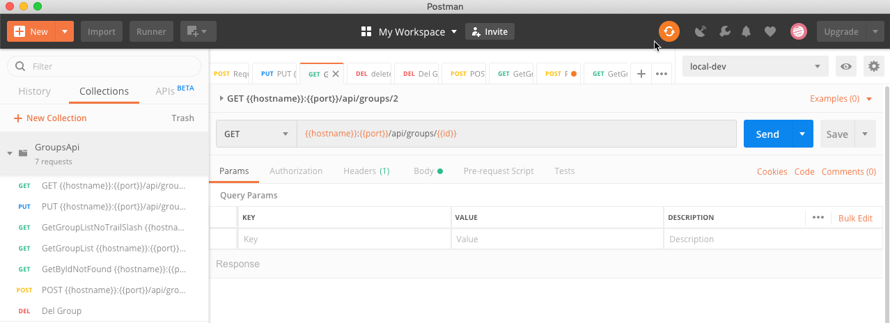

## Create the Tests in the Postman Application

The [Postman Application](https://www.getpostman.com/downloads/) 
can be used to generate API test cases in manual manner that can then be saved and added to an automated test in Maven
 which can then be run on a build server like Jenkins. The image below shows the UI.
 


Save the tests into the Maven project folder **src/test/resources/postman**
 so that it can be run by the automated test environment


##Executing the Tests for Postman


```bash
mvn clean verify -P docker-integration-tests
```
This command will 

1. start up a working API, via docker containers, to be used in the tests
2. Execute the tests
3. stop the working API


