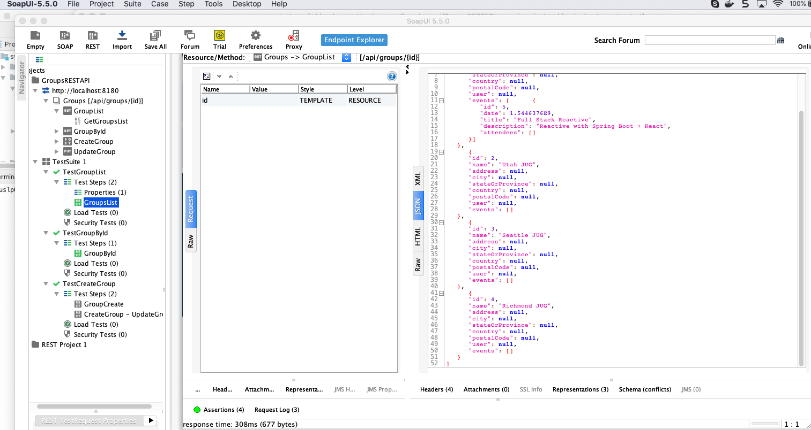

## Create the Tests in the Soap UI Application

The [SoapUI Application](https://www.soapui.org/downloads/latest-release.html) 
can be used to generate API test cases in manual manner that can then be saved and added to an automated test in Maven
 which can then be run on a build server like Jenkins. The image below shows the UI.
 


Save the tests into the Maven project folder so that it can be run by the automated test environment


##Executing the Tests for soapui


```bash
mvn clean verify -P soapui-integration-tests
```
This command will 

1. start up a working API to be used in the tests
2. Execute the tests
3. stop the working API

Any failed tests will show up on the output folder that is defined in the project as testOutput


